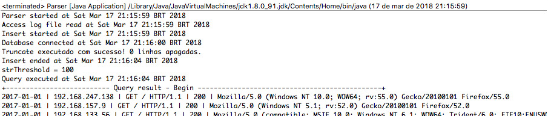

# wallethub
Java JAR Maven application with MySQL Connector dependencies included by maven assembly plugin.
Benchmark to upload 116.484 lines to MySQL table and execute a sub query with criteria in 5 seconds

# Description and behavior
## Faster File Reader
## Faster Insert to database
Optimized queries to retrieve data

[Benchmark evidence for MacOS I5]()

## Pre-reqs
Java 8
MySQL 5.7
Maven
accesslog (separated file)
